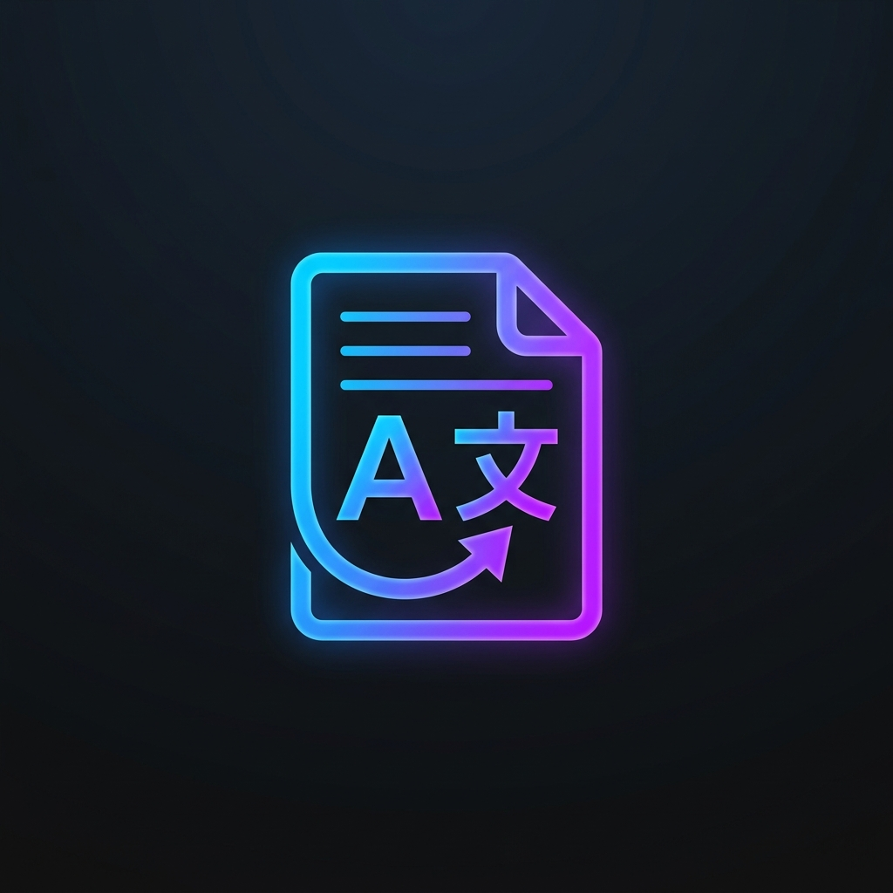

<div align="center">
  
  
  # 📄 Free PDF Translator
  **A powerful, open-source tool to translate entire PDF documents while preserving their original layout, formatting, and images.**

  [](#)
  [](#)
  [](#)
  [](#)

  [](https://render.com/deploy?repo=https://github.com/Minato95-ayu/pdf-translater-free)
</div>

<hr/>

## ✨ Features
- **100% Free Translation:** Powered by `deep_translator` (Google Translate engine).
- **Layout Preservation:** Text is translated and placed exactly where the original text was.
- **Smart Font Sizing:** Dynamically scales font sizes to prevent text from overflowing its original boundaries.
- **Mobile Friendly:** Outputs optimized PDFs (`garbage=4`, `deflate=True`) that can be easily shared on WhatsApp and Telegram without corruption.
- **Fallback OCR:** Uses `OCR.space` API to extract text from scanned images within the PDF.

---

## 🏗️ Architecture

This project is built using a modern decoupled architecture:

1. **Frontend (Vite + React + TailwindCSS)**
   - Hosted on **Vercel** for lightning-fast global delivery.
   - Provides a beautiful, glassmorphism UI for users to upload files and select languages.
   - Uses `vercel.json` rewrites to securely proxy API requests to the backend, avoiding CORS issues.

2. **Backend (FastAPI + PyMuPDF)**
   - Hosted on **Render.com** (using Docker).
   - Handles the heavy lifting of PDF parsing, translating, and recompiling.
   - Uses `fitz` (PyMuPDF) to read exact coordinates (`rect`) of every text block, wipe the original text, and write the translated text back into the exact same coordinates.

---

## ⚙️ How It Works (Step-by-Step Logic)

1. **Upload:** User drops a PDF into the React frontend.
2. **Transfer:** The file is sent to the FastAPI backend via a `multipart/form-data` POST request.
3. **Extraction:** PyMuPDF scans each page. For every text block, it extracts the string and its exact bounding box (coordinates).
4. **Translation:** The extracted string is sent to Google Translate via `deep_translator`.
5. **Redaction:** The original text block is "wiped" (covered with a white rectangle).
6. **Reconstruction:** The new translated text is inserted into the wiped bounding box. If the translated text is longer, the font size is dynamically shrunk to fit perfectly.
7. **Delivery:** The backend optimizes the final PDF and streams it directly back to the frontend as a Blob, which the user downloads.

---

## 🚀 Local Setup & Installation

If you want to run this project on your own computer, follow these steps:

### 1. Start the Backend
```bash
cd backend
python -m venv venv
venv\Scripts\activate  # On Mac/Linux use: source venv/bin/activate
pip install -r requirements.txt
python -m uvicorn main:app --port 8000 --reload
```

### 2. Start the Frontend
```bash
cd frontend  # Or root directory depending on your setup
npm install
npm run dev
```

Your app will now be running at `http://localhost:5173`!

---
<div align="center">
  <i>Built with ❤️ by Minato95-ayu</i>
</div>